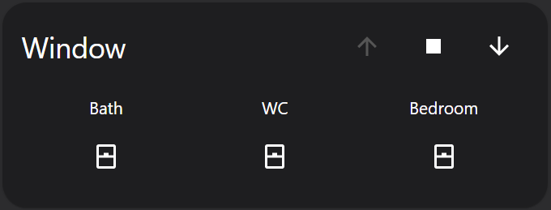
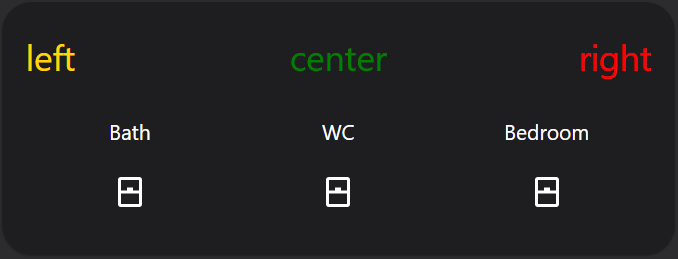

# Lovelace advanced glance card

An advanced glance card with support of advanced card headers:

 | 

## Installation

1. Download the `advanced-glance-card.js` and store it in your `configuration/www` folder.
2. Configure Lovelace to load the card:

```yaml
resources:
  - url: /local/banner-card.js?v=1
    type: module
```

or add this custom component via Settings -> Lovelace Dashboards -> Ressources.

## Configuration
### `title`
* `titel: My Card title`   
Behaves like a regular glance card. The title will be displayed in a single row.

* Text left-center-right example (each of them are optional. But you must specify at least one title).
    ```yaml
    titel:
      left: 'left'
      center: 'center'
      right: 'right'
    ```

* left-center-right example with entity (each of them are optional. But you must specify at least one title).
    ```yaml
    titel:
      left: 'left'
      center: 'center'
      right:
        entity: cover.all_cover
    ```

  --> With this example the cover entity will be shown in the header like in example 1

* conditional header text:
    ```yaml
    titel:
      left:
        - text: 'Window: open'
          entity: binary_sensor.bath_window_contact
          color: var(--paper-item-icon-active-color)
          when:
            state: 'on'
        - text: 'Window: closed'
          entity: binary_sensor.bath_window_contact
          when:
            state: 'off'
      center: 'center'
      right:
        entity: cover.all_cover
    ```

    --> In this example, `Window: open` is visible when the bathroom window contact is `on`. Otherwise `Window: closed` is visible.

### Configuration examples (example 1)
```yaml
type: 'custom:advanced-glance-card'
title:
  left:
    - text: Window
      entity: binary_sensor.bath_window_contact
      color: var(--paper-item-icon-active-color)
      when:
        state: 'on'
    - text: Window
      entity: binary_sensor.bath_window_contact
      when:
        state: 'off'
  right:
    entity: cover.all_cover
entities:
  - entity: binary_sensor.bath_window_contact
    name: Bath
    tap_action:
      action: call-service
      service: browser_mod.popup
      service_data:
        title: Bath
        card:
          type: entities
          entities:
            - entity: binary_sensor.bath_window_contact
              name: Window
            - entity: cover.bath
              name: Cover
        deviceID:
          - this
          - dashboard
  - entity: binary_sensor.wc_window_contact
    name: WC
    tap_action:
      action: call-service
      service: browser_mod.popup
      service_data:
        title: WC
        card:
          type: entities
          entities:
            - entity: binary_sensor.wc_window_contact
              name: Window
        deviceID:
          - this
          - dashboard
  - entity: binary_sensor.bedroom_window_contact
    name: Bedroom
    tap_action:
      action: call-service
      service: browser_mod.popup
      service_data:
        title: Bedroom
        card:
          type: entities
          entities:
            - entity: binary_sensor.bedroom_window_contact
              name: Window
            - entity: cover.bedroom
              name: Cover
        deviceID:
          - this
          - dashboard
```

### Configuration examples (example 2)
```yaml
type: 'custom:advanced-glance-card'
title:
  left:
    text: left
    color: var(--paper-item-icon-active-color)
  center:
    text: center
    color: green
  right:
    text: right
    color: red
entities:
  - entity: binary_sensor.bath_window_contact
    name: Bath
    tap_action:
      action: call-service
      service: browser_mod.popup
      service_data:
        title: Bath
        card:
          type: entities
          entities:
            - entity: binary_sensor.bath_window_contact
              name: Window
            - entity: cover.bath
              name: Cover
        deviceID:
          - this
          - dashboard
  - entity: binary_sensor.wc_window_contact
    name: WC
    tap_action:
      action: call-service
      service: browser_mod.popup
      service_data:
        title: WC
        card:
          type: entities
          entities:
            - entity: binary_sensor.wc_window_contact
              name: Window
        deviceID:
          - this
          - dashboard
  - entity: binary_sensor.bedroom_window_contact
    name: Bedroom
    tap_action:
      action: call-service
      service: browser_mod.popup
      service_data:
        title: Bedroom
        card:
          type: entities
          entities:
            - entity: binary_sensor.bedroom_window_contact
              name: Window
            - entity: cover.rollo_schlafzimmer
              name: Cover
        deviceID:
          - this
          - dashboard

```

# Abstract
Thanks to @nervetattoo. The project structure and some code pieces are simply copy-pasted from his project [banner-card](https://github.com/wehrstedt/banner-card).
